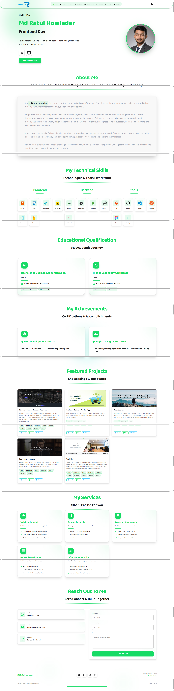

# Portfolio Website of Ratul Islam

## Overview
Welcome to my personal portfolio website!  
I’m Ratul Islam, a passionate and self-motivated web developer from Bangladesh.  
This portfolio showcases my skills, education, projects, and contact information, built with modern web technologies for a smooth and responsive user experience.

## Live Demo Link
[Live sebsite](https://md-ratul-howlader-portfolio.netlify.app/)

## Features
- Fully responsive design for mobile, tablet, and desktop  
- Smooth scrolling navigation  
- Sections: Introduction, About Me, Skills, Education, Projects, Contact  
- Project showcase with live demo and GitHub links (client & server)  
- Contact options with clickable Email, Phone, and WhatsApp links  
- Dark mode support using DaisyUI  
- Scroll animations using AOS library  
- Anyone can contact with what'sapp, gmail and send me an email to hire

## Technologies Used
- React  
- Tailwind CSS  
- DaisyUI  
- React Router  
- React Scroll  
- React Hot Toast  
- AOS (Animate On Scroll)  
- React Icons  
- EmailJS

## 📸 Image

